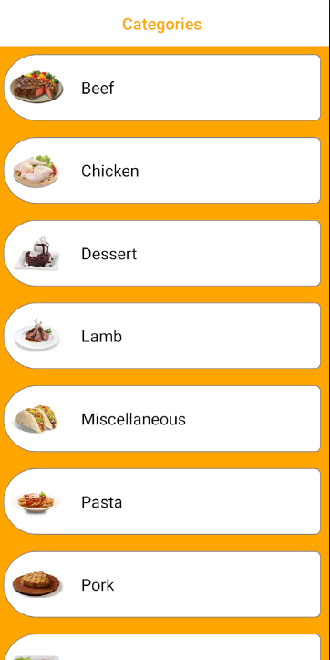
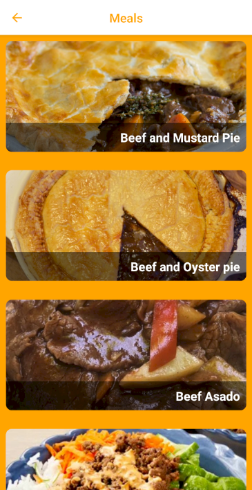
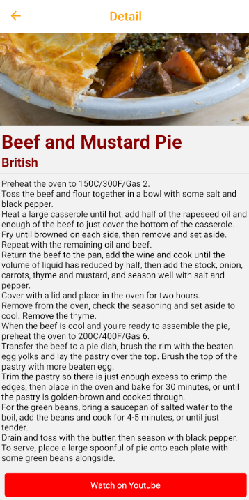

# Tarif Uygulaması

Bu proje, kullanıcılara farklı yemek tarifleri sunan bir React Native uygulamasıdır. Uygulama, kategorilere göre tarifleri keşfetmenize ve her bir yemeğin detaylarına ulaşmanıza olanak tanır. Ayrıca, YouTube videoları aracılığıyla yemeklerin nasıl yapıldığını izleyebilirsiniz.

## Özellikler

- Yemek kategorileri seçimi
- Seçilen kategoriye göre yemeklerin listelenmesi
- Her yemeğe ait detaylı bilgi ekranı
- YouTube üzerinden yemek yapılış videolarına erişim

## Kurulum

### Gereksinimler

- npm veya yarn
- React Native CLI veya Expo CLI
- Android Studio veya Xcode (Emülatör veya fiziksel cihaz kullanımı için)

### Adımlar

1. **Depoyu klonlayın:**

   ```
   git clone https://github.com/Dogukan-Hellac/Tarifka.git
   cd tarifka
   ```
2. **Expoyu Başlat**
    ```
    npx expo start
    ```

### Ekran Görüntüleri





